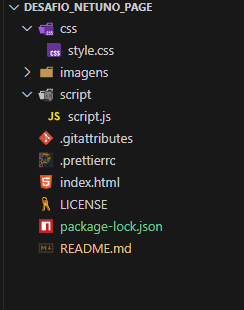

# 🌊 Desafio Netuno Page

Landing page desenvolvida como parte do **Desafio Netuno**, com foco em **design responsivo**, **boas práticas de HTML, CSS e Bootstrap**, e **organização de código**.

---

## 📖 Sobre o projeto

O **Desafio Netuno Page** é uma landing page desenvolvida para demonstrar habilidades em **desenvolvimento front-end**, especialmente na criação de layouts modernos e responsivos com **Bootstrap**.

A página conta com:
- Cabeçalho com menu responsivo  
- Seções de conteúdo com texto e imagens  
- Formulário de contato funcional (HTML)  
- Rodapé com links de redes sociais e informações de contato  
- Responsividade para dispositivos móveis, tablets e desktops  

---

## 🚀 Demonstração

🔗 **Acesse o projeto online:** [https://wellingtonlimaa.github.io/desafio_netuno_page/](#)  

---

## 🧩 Tecnologias utilizadas

- **HTML5** → estrutura semântica  
- **CSS3** → estilização e responsividade personalizada  
- **Bootstrap 5** → grid system, componentes e layout responsivo  
- **JavaScript (vanilla)** → interações simples e manipulação de elementos  
- **Prettier / Configurações de formatação** → padronização de código  

---

## 📁 Estrutura do projeto

<!-- desafio_netuno_page/
├── css/
│ └── estilos.css
├── imagens/
│ ├── logo.png
│ └── (outras imagens)
├── script/
│ └── main.js
├── index.html
├── README.md
├── LICENSE
├── .prettierrc
└── .gitattributes -->

